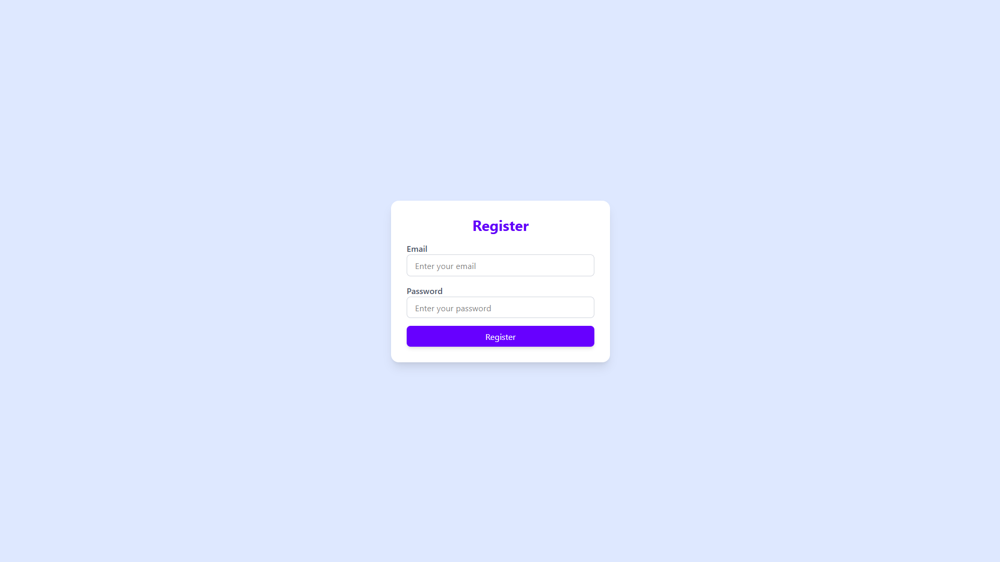
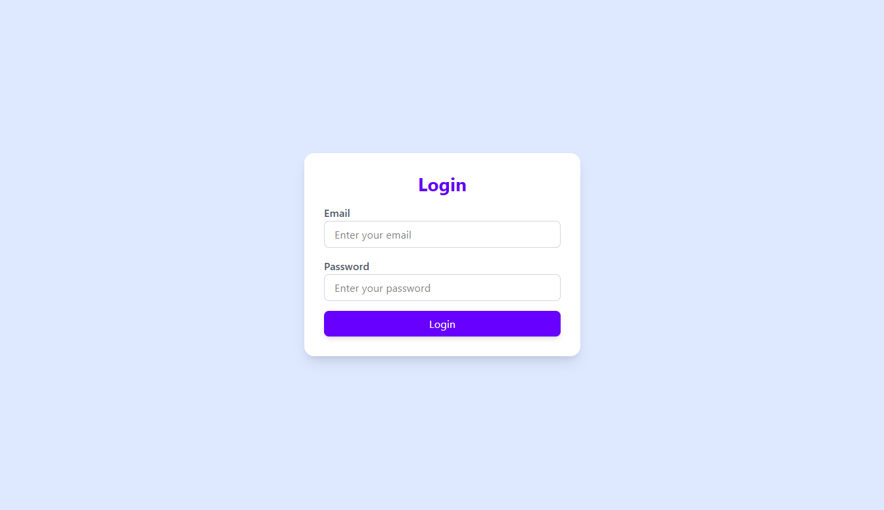
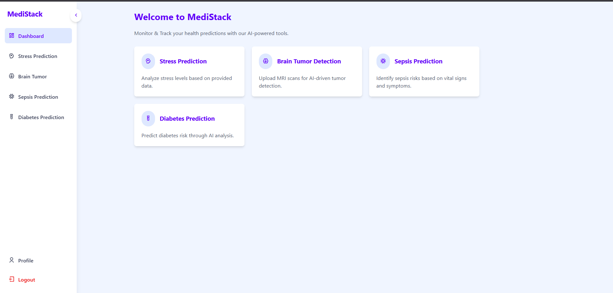
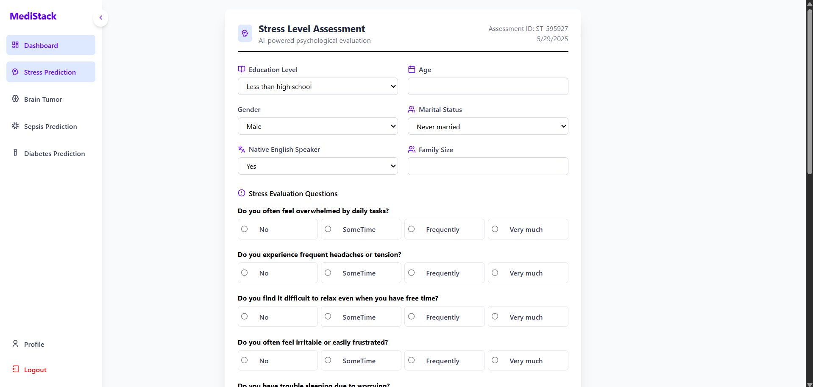
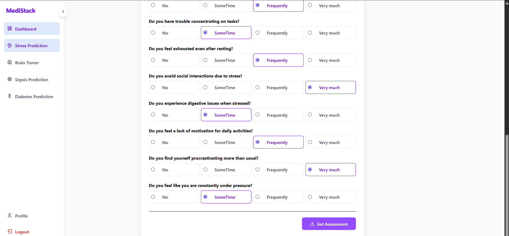
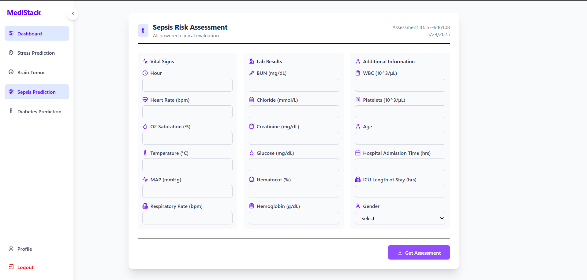

# 🧠 Medi-Sense

A unified health diagnostic platform that integrates **four powerful machine learning models**—Detect **Sepsis**, **Diabetes**, **Stress**, and **Brain Tumor**—all in one place. Medi-Sense aims to assist users in understanding potential health risks through AI-driven predictions.


---

## 🗂️ Project Structure

### medi-sense/
&nbsp;&nbsp;├── client/  <br>
&nbsp;&nbsp;├── server/  <br>
&nbsp;&nbsp;├── server_python/  <br>
&nbsp;&nbsp;└── README.md <br>

---

## 🚀 Features

- ✅ Brain Tumor Detection via MRI Images (CNN)
- ✅ Stress Level Detection using Mental Health Questionnaire
- ✅ Diabetes Risk Prediction using Health Data
- ✅ Sepsis Prediction using Clinical Measurements
- 🧩 Easy-to-use unified interface
- 🌐 Fully responsive web application
- 🔗 Node.js + Flask hybrid backend

## 🛠️ Tech Stack

### Frontend (📁 `client`)
- React.js
- Tailwind CSS
- Axios for API calls


### Backend (📁 `server`)
- Node.js
- Express.js
- JWT Auth (if implemented)
- MongoDB


### ML Model APIs (📁 `server_python`)
- Python 3.x
- Flask
- Scikit-learn / TensorFlow 
- Trained models serialized with `joblib` or `pickle`

---

## 📦 Installation

```bash
git clone https://github.com/yourusername/medi-sense.git

cd medi-sense
```

### 📦Install client dependencies
```bash
cd client
npm install
```

### 📦Install Server dependencies
```bash
cd client
npm install
```

### 📦Setup server_python

#### Create `/PKL` folder in `server_python`

> Download models from below link and place them in `/PKL/` folder
> https://drive.google.com/drive/folders/1TDX3nRaRHqU9FS4byL-J79DBQxgwv_US?usp=drive_link

```bash
> pip install requirement.txt
```

## Execute client, server and python_server

### client
```bash
> cd client
> npm run dev
```

### server
```bash
> cd server
> npm test
```

### server_python
```bash
> cd server_python
> python app.py
```

## 📸 Screenshots

### 🏠 Login/Signup Page
<p align="center">  <br>  </p>

### 🔐 Dashboard
<p align="center"><br> </p>

### 🏠 Models
<p align="center"> 
 <br> 
 <br>
 <br>

 </p>


## Made with ❣️ by
<b> 
<a href="https://github.com/virtualharsh/">Harsh</a>  <br>
<a href="https://github.com/jayjoshi2512/">Jay</a> <br>
<a href="https://github.com/">Krish</a> <br>
<a href="https://github.com/Nisheet-Patel/">Nishit</a> <br>
</ >
